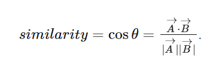

/c/Users/ASUS/AppData/Roaming/Python/Python311/Scripts/django-admin.exe startproject Mobile_Store

python -m django startapp app
py manage.py migrate
py manage.py runserver
py manage.py collectstatic : chay lai du an
py manage.py makemigrations: them cai gi do vao
py manage.py migrate : hoan thanh cau hinh trang web
py manage.py createsuperuser
1. pip install django
2. pip install pillow: de hien hinh anh
3. py manage.py createsuperuser

git status
git add .
git commit -m "...."
git checkout name_branch
git push origin name_branch
git push -u origin name_branch nhánh chưa tồn tại

tai cac thu vien de tim kiem bang hinh anh:
pip install Pillow

thu vien trich xuat dac trung hinh anh:
pip install imagehash
pip install opencv-python
pip install opencv-contrib-python
mkdir -p app/management/commands
touch app/management/commands/update_product_features.py

Tìm kiếm hình ảnh:
- chuyển đổi ảnh sang màu xám:
    giảm số lượng thông tin cần xử lý

1. Trích xuất đặc trưng
Sử dụng thuật toán SIFT: O(N * M)
    N là số lượng ảnh
    M là số lượng điểm đặc trưng phát hiện
    nhận diện chúng dưới dạng vector

2. So sánh độ tương đồng: O(d)
    d là số chiều vector
    các đặc trưng của mỗi sản phẩm được lưu dưới dạng 1 mảng vector

    - để tính độ tương đồng cần sử dụng thuật toán:
    cosine similarity:
        
    
    A là vector đặc trưng của ảnh tải lên.
    B là vector đặc trưng của sản phẩm trong DB
    đo góc giữa 2 vector: [-1, 1]
    giá trị càng gần 1 thì độ tương đồng càng cao.
3. Lọc kết quả theo ngưỡng: O(N log N)
    trên 50% để loại bỏ sản phẩm có lượng tương đồng thấp

4. Sắp xếp kết quả: O(N log N)
    theo thứ tự tốt nhất đến tệ nhất

5. Lựa chọn kết quả tốt nhất:
    tầm 8 ảnh trở về.

Ưu điểm:
    1. khả năng nhận dạng mạnh mẽ
    2. độc lập với độ sáng và độ tương phản
    3. hiệu quả khi so sánh với nhiều hình ảnh
    4. Lọc kết quả không liên quan
    5. Tập trung vào kết quả quan trọng nhất
Nhược điểm:
    1. chi phí tính toán cao
    2. không phù hợp cho ảnh có đặc trưng cục bộ
    3. cosine similarity không phản ánh tương đồng trong không gian chính xác.
    4. Lọc theo ngưỡng có thể gây ra thiếu hiệu quả
    5. tốc độ giảm dần theo dữ liệu mặt hàng tăng

Mặc dù trích xuất đặc trưng và tìm độ tương đồng giữa góc của 2 vector tiến đến gần 1 thì ảnh gần giống hơn nhưng có nhiều trường hợp bị sai khi thử tìm kiếm người với mặt hàng thì nó xuất hiện kết quả. vì vậy thuật toán có sự sai sót nhất định nên phải sử dụng yolo để tối ưu hóa tìm kiếm bằng hình ảnh với trường hợp keyword không phải là cellphone thì sẽ không tìm thấy mặt hàng nào.

cách cài yolo.
pip install torch torchvision torchaudio
pip install ultralytics