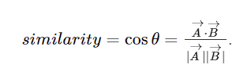

# Mobile Web

### User interface
<video controls src="1.mp4" title="Title"></video>

### Admin interface
<video controls src="2.mp4" title="Title"></video>

# 1. Thiết lập cơ bản cho dự án Django
/c/Users/ASUS/AppData/Roaming/Python/Python311/Scripts/django-admin.exe startproject Mobile_Store

# Khởi tạo dự án và ứng dụng
- django-admin startproject Mobile_Store
- python -m django startapp 

# Chạy các lệnh quản lý
- py manage.py migrate  # Áp dụng các migration mặc định
- py manage.py makemigrations  # Tạo migration từ các thay đổi trong models
- py manage.py migrate  # Áp dụng các migration
- py manage.py runserver  # Chạy server
- py manage.py collectstatic  # Thu thập các file tĩnh
- py manage.py createsuperuser  # Tạo tài khoản admin

# Cài đặt thư viện
- pip install django
- pip install pillow  # Hỗ trợ xử lý hình ảnh
- pip install psycopg2  # Kết nối PostgreSQL
- pip install imagehash opencv-python opencv-contrib-python  # Xử lý và trích xuất đặc trưng hình ảnh
- pip install torch torchvision torchaudio ultralytics  # YOLO và mô hình học sâu

# Quản lý với Git
- git status
- git add .
- git commit -m "Nội dung commit"
- git checkout name_branch  # Chuyển sang branch mới
- git push origin name_branch  # Đẩy branch lên Git
- git push -u origin name_branch  # Đẩy branch mới chưa tồn tại

# 2. Tìm kiếm bằng hình ảnh
```
1 chuyển đổi ảnh sang màu xám: giảm số lượng thông tin cần xử lý
2. Trích xuất đặc trưng
3. Sử dụng thuật toán SIFT: O(N * M)
    - N là số lượng ảnh
    - M là số lượng điểm đặc trưng phát hiện nhận diện chúng dưới dạng vector

4. So sánh độ tương đồng: O(d)
    d là số chiều vector các đặc trưng của mỗi sản phẩm được lưu dưới dạng 1 mảng vector
    - để tính độ tương đồng cần sử dụng thuật toán:
```
`
     cosine similarity:
         
```

    A là vector đặc trưng của ảnh tải lên.
    B là vector đặc trưng của sản phẩm trong DB
    đo góc giữa 2 vector: [-1, 1]
    giá trị càng gần 1 thì độ tương đồng càng cao.

4. Lọc kết quả theo ngưỡng: O(N log N)
    trên 50% để loại bỏ sản phẩm có lượng tương đồng thấp

5. Sắp xếp kết quả: O(N log N)
    theo thứ tự tốt nhất đến tệ nhất

6. Lựa chọn kết quả tốt nhất:
    tầm 8 ảnh trở về.
```   
- Ưu điểm:
    - 1. khả năng nhận dạng mạnh mẽ
    - 2. độc lập với độ sáng và độ tương phản
    - 3. hiệu quả khi so sánh với nhiều hình ảnh
    - 4. Lọc kết quả không liên quan
    - 5. Tập trung vào kết quả quan trọng nhất
- Nhược điểm:
    - 1. chi phí tính toán cao
    - 2. không phù hợp cho ảnh có đặc trưng cục bộ
    - 3. cosine similarity không phản ánh tương đồng trong không gian chính xác.
    - 4. Lọc theo ngưỡng có thể gây ra thiếu hiệu quả
    - 5. tốc độ giảm dần theo dữ liệu mặt hàng tăng

- Nhận xét:
Mặc dù trích xuất đặc trưng và tìm độ tương đồng giữa góc của 2 vector tiến đến gần 1 thì ảnh gần giống hơn nhưng có nhiều trường hợp bị sai khi thử tìm kiếm người với mặt hàng thì nó xuất hiện kết quả. vì vậy thuật toán có sự sai sót nhất định nên phải sử dụng YOLO để tối ưu hóa tìm kiếm bằng hình ảnh

- cài database:
    pip install psycopg2
    pip freeze > requirements.txt
# 3. Chức năng cơ bản của ứng dụng
- CRUD, Sort, Search items
- CRUD account
- CRUD status items
- CRUD shipping address
- Order successfully placed notification
